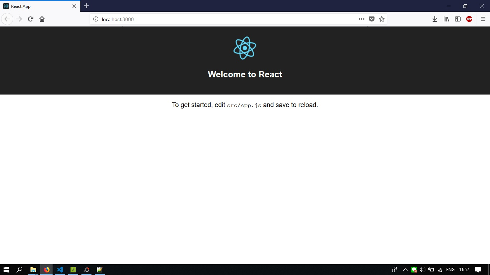
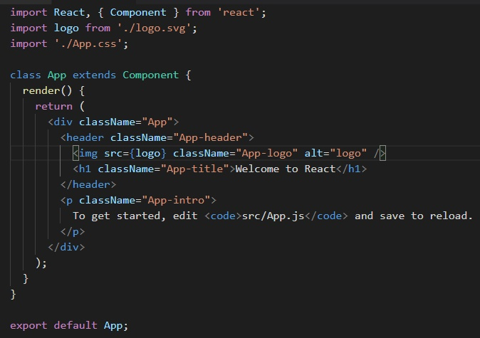
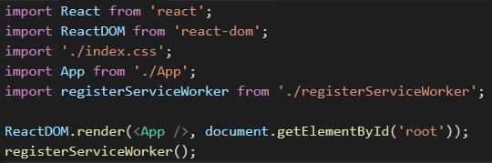
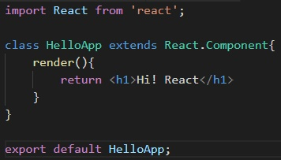
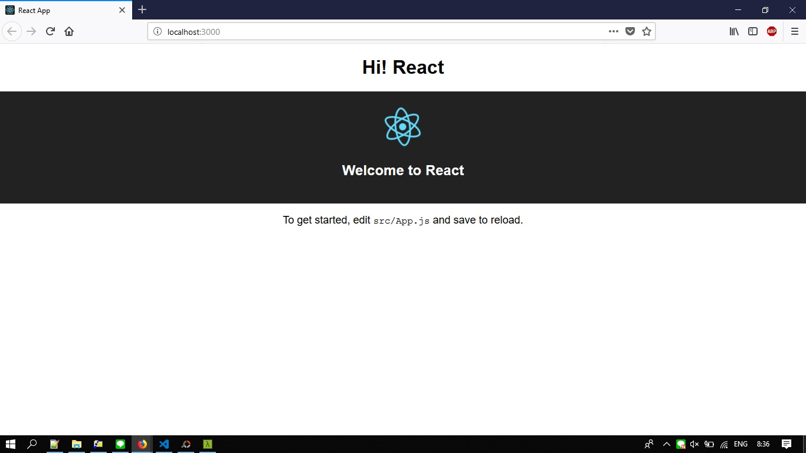
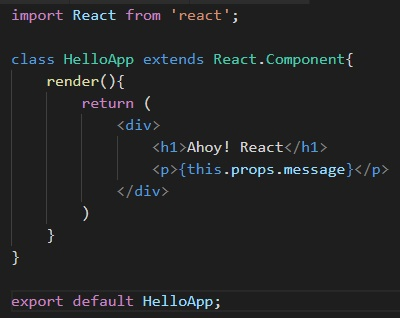
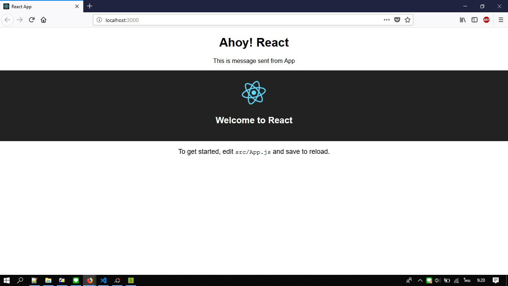
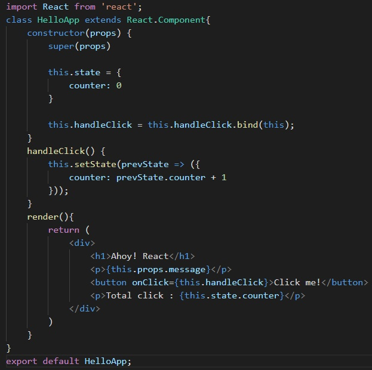
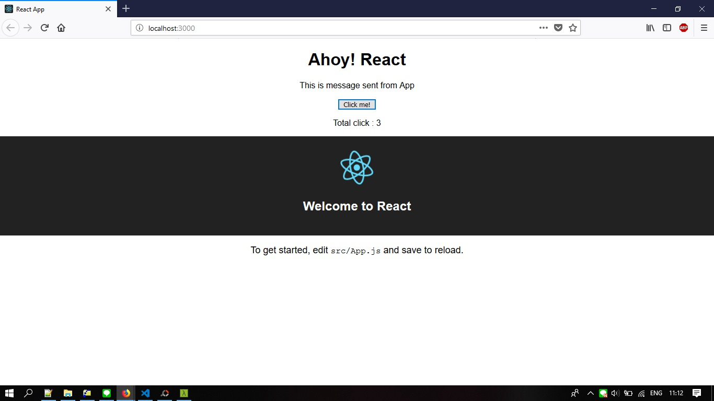
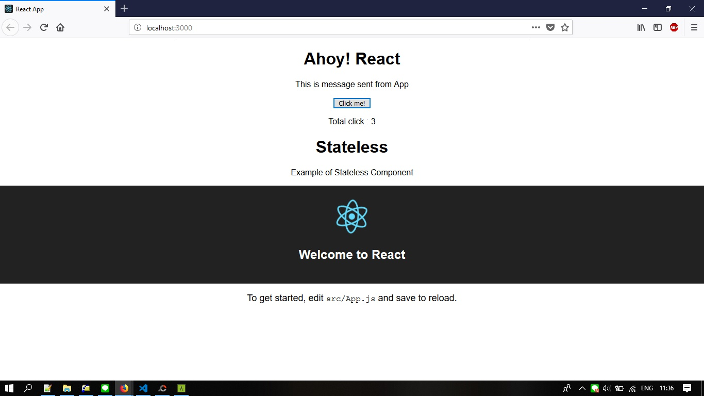

# React Tutorail

## React คืออะไร?

React เป็น JavaScript Library ที่เอาไว้สำหรับทำ UI (พัฒนาโดย Facebook) ซึ่ง React ไม่ใช่ SPA Framework (Single Page Application) อย่าง Angular แต่เป็นเพียงแค่ตัว V ใน MVC (Model View Controller) เท่านั้น คือเอาไว้ render พวก Component หรือ Element ต่างๆ ในหน้า HTML เท่านั้น

## Step 1 : Getting Started

**Create React App** เป็น Command Line Tools ที่เอาไว้ให้เราสร้างโปรเจ็ค React 

สำหรับ npm version 5.2+ ใช้คำสั่งนี้ :

    npx create-react-app react-app

และ สำหรับ npm เวอร์ชั่นต่ำกว่า

    npm install -g create-react-app
    create-react-app react-app

***Note:*** react-app : ชื่อโปรเจค

หลังจากนั้น เราก็จะได้โปรเจ็คที่เป็น React ขึ้นมา

    cd react-app        
    npm start       //Run project

เมื่อรันแล้ว มันจะเปิดหน้าเว็บเราให้อัตโนมัติ โดย default แล้วจะเป็น http://localhost:3000 หน้าตาเว็บเราก็จะเป็นแบบนี้

ที่นี้กลับมาดูที่ตัวโปรเจ็คเรา ทำการเปิดด้วย Text Editor หรือ IDE ที่เราถนัดเลย ซึ่งไฟล์ที่สำคัญๆจะประกอบไปด้วย

- **public/index.html** : คือไฟล์ html หลักของเรา
- **src/index.js** : เป็นไฟล์หลักของ React
- **src/App.js** : ไฟล์สำหรับ Component ที่ชื่อว่า App

ซึ่งเมื่อเปิดดูไฟล์ **App.js** จะมีโค๊ดด้านล่างดังนี้

- `import { Component } from 'react';` คือการ Import module จะมีทั้ง import default และ import module
- `export default App;` คือการ export ตัว Component App เพื่อเอาไปใช้ที่ไฟล์อื่น

จากโค๊ดด้านบนจะเห็นว่ามีส่วนที่คล้ายๆ HTML นั่นก็คือตรงส่วนที่อยู่ใน `render()` ซึ่งมันก็คือการ render HTML นั่นเอง เพียงแต่ render ในรูปแบบ *JSX Syntax* ที่สามารถใส่โค๊ด JavaScript ลงไปใน HTML ได้ เช่น

    

จะเห็นได้ว่าเราสามารถใส่ script ลงใน HTML ได้ผ่าน `{}`
และ **App** คือ Component ที่ extend มาจาก `React.Component` (คือการ extends Component และ funtion render() เพื่อ return เป็น HTML Element กลับมา)

และเปิดดูไฟล์ **/src/index.js** เป็นไฟล์ที่จะใช้รัน React

จะเห็นว่ามีส่วน `ReactDOM.render(<App />, document.getElementById('root'))` มันเป็นการบอกว่า หา element ที่มี id ชื่อว่า *root* จากนั้นก็ทำการ render React Component โดยในที่นี่ทำการ render ตัว *App* ญึ่ง id=root เราได้ประกาศไว้ในไฟล์ **public/index.html** นั่นเอง

ตัวอย่างการใช้ Component ร่วมกับ HTML ดู สมมติสร้าง Component ใหม่ และตั้งชื่อว่า **HelloApp.js**

จากนั้นไปที่ไฟล์ **src/App.js** เพิ่ม code นี้ลงไป

    import HelloApp from './HelloApp';

และตรงส่วน `render()` ก็ทำการเพิ่ม 
    
    <HelloApp />

ทีนี้เมื่อลองดูหน้าเว็บอีกครั้ง เราจะเห็น ***Hi! React***

## Step 2 : Props & State

### Props

Props หรือชื่อเต็มๆมันคือ Properties หากเปรียบกับ HTML แล้ว ตัว Props จะเป็นคล้ายๆ attributes ของ HTML ดัง เช่น *src*, *href* หรือ *class*

    
    <a href="#" class="my-link">Click!</a>

ซึ่ง Props ใน React ข้อดีคือ เราสามารถส่งข้อมูลจาก Component หนึ่งไปอีก Component ได้ด้วยการใช้ Props 

**ตัวอย่าง** ไปที่ไฟล์ **App.js** แก้ไขโค้ดที่เรียก HelloApp ทำการส่ง props ไปกับ Component ด้วย แบบนี้

    <HelloApp message="This is message sent from App" />

และจากนั้นไปที่ไฟล์ **HelloApp.js** แก้ไขโค้ดที่ส่วนของ return

จะเห็นได้ว่า `render()` นั้น return ค่าหลายบรรทัด เราจะใช้ **()** ซึ่งจำเป็นต้อง wrap element ด้วย

ผลลัพธ์

***หมายเหตุ:*** แต่ถ้าเราต้องการ render ต้องใช้ div มาหุ้มหรือสามารถใช้ Fragment จะไม่ทำให้ error
เช่น

    

        <h1>Ahoy! React</h1>
        
{this.props.message}

    

    หรือ

    <React.Fragment>
        <h1>Ahoy! React</h1>
        
{this.props.message}

    </React.Fragment>

### State

State เป็นค่าที่จะถูกใช้ ภายใน Component วิธีการใช้งาน State ทำการสร้าง Constructor ขึ้นมา จากนั้น set ค่า default state ด้วยคำสั่ง `this.state = {}`

**ตัวอย่าง** ไปที่ไฟล์ **HelloApp.js** จากนั้นทำการแก้ไขโค้ดดังนี้

***อธิบาย***

- โดยให้ counter เก็บไว้ใน state มีค่าเริ่มต้น 0
- ทำการ render ค่า counter ด้วย `{this.state.counter}`
- เมื่อเราต้องการจะ set ค่าให้กับ **state** เราสามารถเรียกใช้ `this.setState()` ได้แบบนี้

        this.setState({
            key: value
        });

- ในตัวอย่าง เมื่อทำการ Click button จะทำให้เพิ่มจำนวน *counter* ทีละ 1 โดยการใช้ `setState()` ที่ `<button>Click me!</button>`
ทำการเพิ่ม onClick เข้าไป

        <button onClick={this.handleClick}>Click me!</button>

- เมื่อมี event click จะไปเรียก method *handleClick* ซึ่งเรายังไม่ได้สร้าง ต่อมาสร้าง method *handleClick*

        handleClick() {
            this.setState({
                counter: this.state.counter + 1
            })
        }

- เราจะยังไม่สามารถกดได้ เนื่องจากตัว button เวลาถูก click มันไปเรียก handleClick แต่ว่า this ในฟังค์ชั่น มัน refer ไปที่ button ไม่ใช่ Class มัน เราจึงต้องทำการ bind ใน Constructor ก่อน

        constructor(props) {
            this.handleClick = this.handleClick.bind(this)
        }

- แต่ว่า เนื่องจากเวลาเรา `setState()` ถ้าเกิดว่ามีการอัพเดท state เดิม มันจะมี side effect บ้างในบางครั้ง ทาง React แนะนำว่า ให้ใช้การ setState()แบบ function แทน ซึ่ง function ก็มี 1 argument เป็น state ก่อนหน้า และ return เป็น new state เช่น

        this.setState(function(prevState) {
            return {
                counter: prevState.counter + 1
            }
        });

        แปลงด้านบนเป็น ES6 ให้สวยๆดีกว่า

        this.setState(prevState => ({
            counter: prevState.counter + 1
        }))

ทีนี้ลองกลับไปดูแล้วลอง คลิ๊ก Button จะเห็นว่า ค่าถูกอัพเดทตามที่เรากดเลย

### สรุประหว่าง Props และ States

- Props : จะเป็นการส่งข้อมูลข้าม Component
- State : ข้อมูลจะถูกใช้ภายใน Component ตัวเอง
- State : เมื่อ State มีการเปลี่ยนแปลง Component จะทำการ render() ใหม่

## Stateless Component

การสร้าง Component อีกแบบนึง ที่เรียกว่า Stateless Component คือ Component ที่ไม่มี State

วิธีการสร้าง Stateless Component เช่น

    function Hello(props) {
        return <h1>Ahoy! {props.name}</h1>
    }

ด้านบน เป็น function ที่รับ prop มา แล้ว return เป็น JSX กลับไป ทีนี้เราลองมาสร้าง Stateless ใน **HelloApp.js** ดู เพิ่ง function ด้านบน เข้าไปก่อนบรรทัด class HelloApp

    function Hello(props) {
        return <h1>Ahoy! {props.name}</h1>
    }

    class Hello App extends React.Component {
        ...
    }

และส่วน `render()` ก็แค่เรียกใช้ Component Hello พร้อมส่ง props ที่ชือ่ว่า name ไปด้วย แบบนี้

    <Hello name="Chai" />

### ข้อดีของ Stateless Component คือ

- ไม่ต้อง extends Class ให้ยุ่งยาก
- ไม่ต้องใช้ this (ไม่ต้อง bind ใน Constructor) แล้ว เช่น this.props.name ก็ใช้ props.name ได้เลย หรือ {onClikc={handleClikc}

**ตัวอย่าง** Stateless Component อีกอัน ลองสร้างขึ้นมาชื่อ **MyStatelessComponent.js**

    import React from 'react';

    const MyStatelessComponent = (props) => (
        

            <h1>{props.title}</h1>
            
{props.message}

        

    )

    export default MyStatelessComponent;

หรือสามารถ เขียน MyStatelessComponent ใหม่อีกแบบ ด้วย ES6 Destructuring ดังนี้

    import React from 'react';

    const MyStatelessComponent = ({ title, message }) => (
        

            <h1>{title}</h1>
            
{message}

        

    )

    export default MyStatelessComponent;

แล้วไปที่ไฟล์ **App.js** ก็ลองทำการเรียกใช้

    import MyStatelessComponent from './MyStatelessComponent';

    render() {
        <MyStatelessComponent title="Stateless" message="Example of Stateless Component"/>
    }

ผลลัพธ์

### [Credit](https://devahoy.com/posts/learn-react-with-create-react-app/)